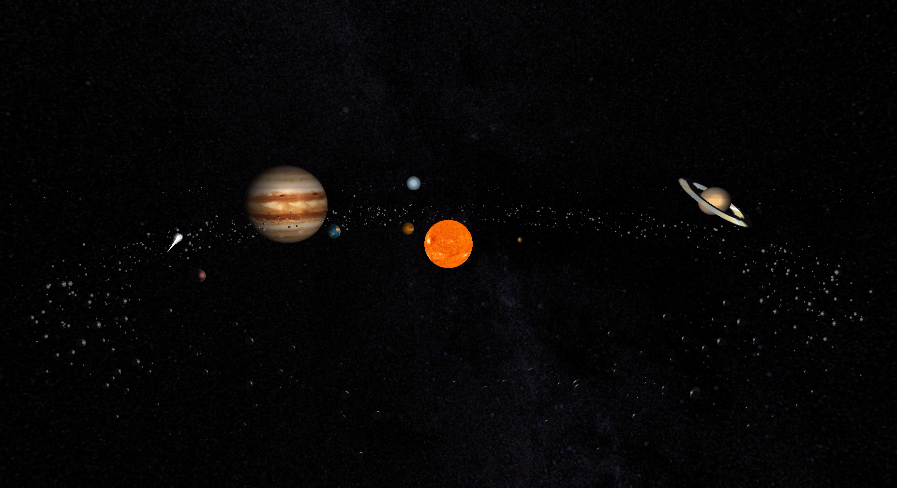
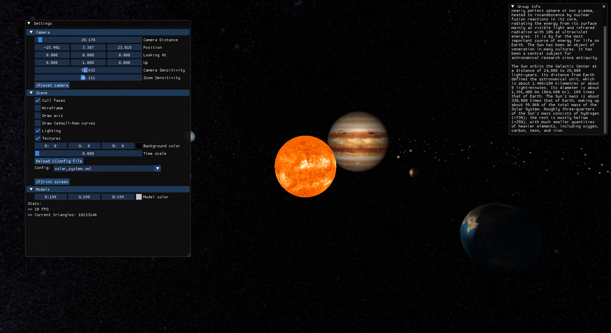

# Mini Scene Graph 3D Engine

## Overview




This project implements a mini scene graph–based 3D engine along with a model generator. The project is divided into two main modules:

- **Generator**: A command-line tool that creates 3D model files (with a `.3d` extension) representing various graphical primitives such as planes, boxes, spheres, cones, cylinders, and tori. It also supports generating Bezier patches from a `.patch` file.
- **Engine**: A real-time rendering application that reads an XML configuration file and renders the specified models using OpenGL.

## Features

### Generator

- **Supported Primitives**:
  - **Plane**: Generates a square plane on the XZ plane, subdivided into a grid.
  - **Box**: Creates a box with configurable dimensions and subdivisions.
  - **Sphere**: Produces a sphere defined by radius, slices, and stacks.
  - **Cone**: Generates a cone using a bottom radius, height, slices, and stacks.
  - **Cylinder**: Builds a cylinder based on radius, height, slices, and stacks.
  - **Torus**: Creates a torus using major/minor radii, slices, and stacks.
  - **Bezier Patch**: Generates a Bezier patch from a `.patch` file, subdivided into a grid.


### Engine

- **XML Configuration**: Reads a configuration file (e.g., `example.xml`) that defines window dimensions, camera parameters, and the list of model files to load.
- **Rendering**: Utilizes OpenGL (with freeGlut) for real-time rendering of the 3D models.
- **User Interaction**: Supports intuitive mouse controls for camera movement and zoom.
- **Modular Design**: Separates concerns between scene parsing, model management, and rendering, enabling future extensions such as hierarchical scenes and advanced transforms.
- **Optimized Performance**: Implements efficient data structures for handling vertex and face data, and uses techniques like Vertex Buffer Objects (VBOs) to enhance performance.
- **User Interface**: Integrates Dear ImGui for a simple GUI to control rendering parameters and view settings.




## Repository Structure

```
.
├── LICENSE
├── README.md
├── engine
│   ├── CMakeLists.txt
│   ├── include
│   │   ├── catmull_rom.hpp
│   │   ├── draw.hpp
│   │   ├── imgui
│   │   │   ... (imgui files)
│   │   ├── menu.hpp
│   │   ├── stb
│   │   │   ... (stb files)
│   │   ├── structs.hpp
│   │   ├── utils.hpp
│   │   └── xml_parser.hpp
│   └── src
│       ├── catmull_rom.cpp
│       ├── draw.cpp
│       ├── imgui
│       │   ... (imgui files)
│       ├── main.cpp
│       ├── menu.cpp
│       ├── structs.cpp
│       ├── utils.cpp
│       └── xml_parser.cpp
├── generator
│   ├── CMakeLists.txt
│   ├── include
│   │   ├── Bezier.hpp
│   │   ├── FileWriter.hpp
│   │   ├── PointsGenerator.hpp
│   │   ├── box.hpp
│   │   ├── cone.hpp
│   │   ├── cylinder.hpp
│   │   ├── plane.hpp
│   │   ├── sphere.hpp
│   │   └── torus.hpp
│   └── src
│       ├── Bezier.cpp
│       ├── FileWriter.cpp
│       ├── PointsGenerator.cpp
│       ├── box.cpp
│       ├── cone.cpp
│       ├── cylinder.cpp
│       ├── main.cpp
│       ├── plane.cpp
│       ├── sphere.cpp
│       └── torus.cpp
├── group_info
│   ├── comet.txt
│   ├── earth.txt
│   ├── earth_moon.txt
│   ├── jupiter.txt
│   ├── mars.txt
│   ├── mercury.txt
│   ├── neptune.txt
│   ├── saturn.txt
│   ├── sun.txt
│   ├── uranus.txt
│   └── venus.txt
├── objects
│   (models end up here)
├── patches
│   ├── comet.patch
│   └── teapot.patch
├── reports
│   ├── CG Trabalho Prático Fase 1.pdf
│   ├── CG Trabalho Prático Fase 2.pdf
│   ├── CG Trabalho Prático Fase 3.pdf
│   └── CG Trabalho Prático Fase 4.pdf
├── scenes
│   ├── config1.xml
│   ├── config2.xml
│   ├── lights.xml
│   ├── normals.xml
│   ├── skybox.xml
│   ├── solar_system.xml
│   └── tex.xml
├── solar_system_xml_generator.py
└── textures
    ├── comet.jpg
    ├── earth.jpg
    ├── jupiter.jpg
    ├── mars.jpg
    ├── mercury.jpg
    ├── moon.jpg
    ├── moon_low_res.jpg
    ├── neptune.jpg
    ├── ring.jpg
    ├── saturn.jpg
    ├── skybox.jpg
    ├── sun.jpg
    ├── uranus.jpg
    └── venus.jpg
```

## Build Instructions

Both the engine and the generator are built using CMake.

1. **Clone the Repository**:

   ```
   git clone https://github.com/2101dudu/CG.git
   cd CG
   ```

2. **Build the Generator**:

   ```
   cd generator
   mkdir build && cd build
   cmake ..
   make
   ```

   The generator executable will be generated in the `build` directory.

3. **Build the Engine**:
   ```
   cd engine
   mkdir build && cd build
   cmake ..
   make
   ```
   The engine executable will be generated in the `build` directory.

## Usage

### Running the Generator

The generator accepts command-line parameters for the primitive type, its parameters, and the destination file. For example:

- Plane:
  ```
  ./generator plane 1 3 plane.3d
  ```
- Box:
  ```
  ./generator box 2 3 box.3d
  ```
- Sphere:
  ```
  ./generator sphere 1 10 10 sphere.3d
  ```
- Cone:
  ```
  ./generator cone 1 2 4 3 cone.3d
  ```
- Cylinder:
  ```
  ./generator cylinder 1 2 4 3 cylinder.3d
  ```
- Torus:
  ```
  ./generator torus 3 1 10 10 torus.3d
  ```
- Bezier:
  ```
  ./generator patch ../../patch/comet.patch 20 patch.3d
  ```

### Running the Engine

To use the pre-build solar system, run the following command:
```
python3 solar_system_xml_generator.py [-h] [-c [1–100]] [-a [10–10000]]
```

After generating or obtaining the necessary model files, run the engine by specifying the XML configuration file:
```
./engine <path_to_config.xml>
```
The configuration file (e.g., `example.xml`) defines:

- **Window Settings**: Width and height.
- **Camera Settings**: Position, look-at vector, up vector, and projection parameters.
- **Scene Description**: List of model files to load and render.

Refer to the sample `example.xml` for details on how to structure your scene.

## Dependencies

- **CMake**: Build system generator.
- **OpenGL**: Rendering API.
- **freeGlut**: Toolkit for windowing and input management.
- **Dear ImGui**: Library for creating the graphical user interface.
- **TinyXML2**: XML parsing library used for reading configuration files.

Ensure that these libraries are installed and accessible in your development environment.

## Team Members

- [Eduardo Faria](https://github.com/2101dudu)
- [Hélder Gomes](https://github.com/helderrrg)
- [Nuno Silva](https://github.com/nunomrs7)
- [Pedro Pereira](https://github.com/pedrofp4444)

## References

- [CMake](https://cmake.org/)
- [OpenGL](https://www.opengl.org/)
- [freeGlut](https://freeglut.sourceforge.net/)
- [Dear ImGui](https://github.com/ocornut/imgui)
- [TinyXML2](https://github.com/leethomason/tinyxml2)
